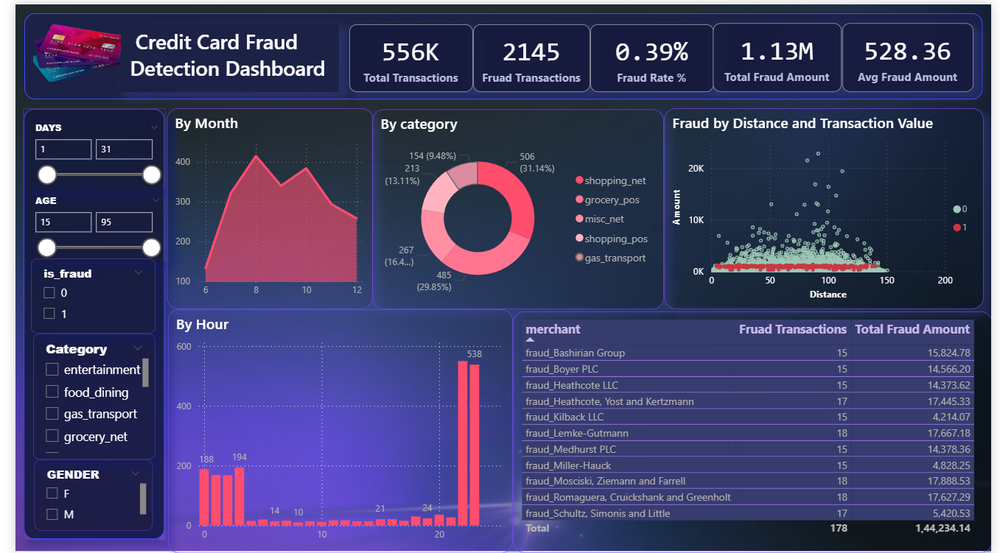

# Credit-Card-Fraud-Detection

📊 Overview :-

This dashboard provides a comprehensive view of fraud patterns, helping analysts identify:
- Monitor fraud trends in real time
- Identify high-risk customers, Suspicious merchants, and categories
- Support data-driven risk mitigation strategies
- Behavioral anomalies (distance vs amount)

📊 Dashboard Features :-

🔢 Executive KPIs :
- Total Transactions
- Fraud Transactions
- Fraud Rate (%)
- Total Fraud Amount
- Avg Fraud Amount

📈 Visual Insights :

📅 Fraud by Month = 
Displays monthly fraud trends
- Helps identify peak fraud periods

🛒 Fraud by Category =
Donut chart showing fraud distribution across:
- Shopping (net & POS)
- Grocery POS
- Miscellaneous
- Gas transport

📍 Fraud by Distance vs Amount = 
Scatter plot analyzing:
- Transaction distance
- Transaction amount
- Helps detect anomalies (e.g., high amount at unusual distance)

⏰ Fraud by Hour = 
Hourly fraud activity pattern

- Identifies high-risk time windows

🏪 Merchant Risk Table = 
Lists top fraudulent merchants

Includes:
- Fraud transaction count
- Total fraud amount

🎛️ Filters & Slicers :-

Interactive filters allow dynamic exploration:
- Date Range (Days)
- Age Group
- Fraud Flag (0 / 1)
- Category
- Gender

🛠️ Tools & Technologies :-

- Power BI
- Data Cleaning: Python (Pandas)
- Dataset: Credit Card Transactions Dataset (Kaggle)

📂 Dataset Features Used :- 

- Transaction details (amount, time, category)
- Customer demographics (age, gender, location)
- Merchant information
- Fraud label (is_fraud)
- Engineered features:
  - Transaction hour/month/year
  - Distance between customer & merchant
  - Average customer spending
  - Amount deviation

💼 Business Impact :-
 - 📉 Identified 0.39% fraud rate across 556K transactions
 - 💰 Analyzed ₹1.13M+ fraud losses to uncover risk patterns
 - 🔍 Enabled detection of high-risk merchants and categories
 - ⏱ Highlighted peak fraud hours for proactive monitoring

🧠 Key Insights Delivered :-
- Fraud is concentrated in specific categories (shopping & POS)
- Certain merchants show consistently high fraud activity
- Fraud spikes during specific hours and months
- Suspicious transactions often occur at short distances with unusual amounts
